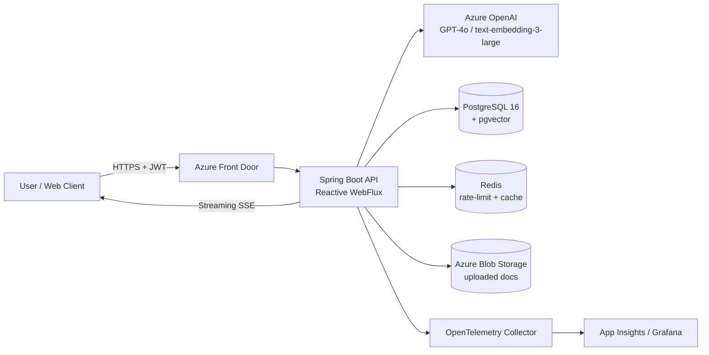
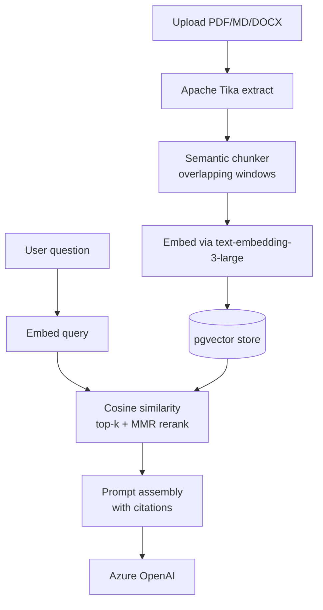

## TL;DR

**Spring AI Assistant** is a production-ready, multi-tenant conversational AI platform built on **Spring Boot 3.3** and **Spring AI 1.0**. It wraps **Azure OpenAI (GPT-4o)** behind a clean, reactive REST API and ships with the things real enterprises actually need: **streaming chat (SSE)**, **persistent conversation memory**, **RAG over private documents** with **pgvector**, **tool/function calling**, **Azure AD authentication**, **rate limiting**, **token & cost tracking**, **Prometheus/OpenTelemetry observability**, and **CI/CD to Azure Container Apps**.

This post walks through the architecture, the most interesting design decisions, and the pieces that turned out to be harder than they looked.

---

## 1. Why this project exists

Most "chatbot tutorials" stop where production engineering begins. They show you how to call an LLM — they don't show you how to:

- Keep a 50-turn conversation coherent without blowing your token budget.
- Stream responses to thousands of concurrent users without melting your server.
- Ground answers in a customer's private knowledge base — and cite the source.
- Let the model *do things* (call APIs, query a DB) safely.
- Track per-tenant cost and enforce per-user quotas.
- Roll out a new prompt without redeploying.

Spring AI Assistant is my answer to those problems, packaged as a reusable backend service.

---

## 2. High-level architecture



The system follows a **hexagonal / clean architecture** with explicit ports and adapters so the LLM provider, vector store, and storage backends are all swappable.

| Layer | Responsibility |
|-------|----------------|
| **API / Web** | Reactive controllers (WebFlux), SSE streaming, OpenAPI docs, request validation |
| **Application / Service** | Conversation orchestration, RAG pipeline, tool dispatch, prompt assembly |
| **Domain** | `Conversation`, `Message`, `Document`, `Chunk`, `TokenUsage` — pure POJOs |
| **Infrastructure** | Azure OpenAI client, pgvector repository, Redis bucket, Azure Blob |
| **Cross-cutting** | Security, observability, rate limiting, error handling |

---

## 3. Key features (in depth)

### 3.1 Streaming chat with backpressure

Responses are streamed over **Server-Sent Events** using Project Reactor `Flux<ChatResponse>`. Every token is forwarded to the client as it arrives from Azure OpenAI, while we *simultaneously* accumulate the assistant message for persistence. This gives a ChatGPT-style typing effect and keeps long responses snappy.

### 3.2 Conversation memory: sliding window + summarization

A naïve "send the whole history" approach explodes token usage on long chats. The assistant uses a two-tier strategy:

1. **Recent window** — last *N* messages kept verbatim.
2. **Rolling summary** — older messages are compressed into a running summary by a cheaper model (GPT-4o-mini), prepended as a system message.

Result: bounded context size, preserved long-term coherence, ~70% cheaper on long sessions.

### 3.3 RAG pipeline



- **Chunking**: ~800 tokens with 120-token overlap, respecting paragraph boundaries.
- **Reranking**: Maximal Marginal Relevance (MMR) to reduce redundant chunks.
- **Citations**: every chunk carries `documentId + page`, surfaced in the final response.

### 3.4 Tool / function calling

Using Spring AI's `@Tool` abstraction, the model can invoke registered Java methods — e.g. `getWeather(city)`, `searchTickets(query)`, `createCalendarEvent(...)`. Schema is auto-generated from method signatures.

### 3.5 Multi-tenancy & security

- **Azure AD (Entra ID)** OIDC login, JWT bearer on every request.
- **Tenant isolation** at the repository layer — every query filters by `tenant_id`.
- **Role-based access**: `USER`, `ADMIN`, `AUDITOR`.
- **PII redaction** on ingest (regex + Presidio-style rules) before embedding.

### 3.6 Rate limiting & cost control

- **Bucket4j + Redis** for per-user / per-tenant quotas.
- **Token meter** records prompt/completion tokens per request and computes cost from a versioned price table.
- Admin dashboard exposes Prometheus-scraped metrics: `tokens_total`, `cost_usd_total`, `latency_p95_ms`.

### 3.7 Observability

- **Micrometer + OpenTelemetry** traces every chat turn through controller → service → Azure OpenAI.
- **Structured JSON logs** with `traceId`, `conversationId`, `tenantId`.
- **Health checks** on Postgres, Redis, Azure OpenAI.

---

## 4. Selected code

> All snippets below are abridged from the working source tree under
> [`spring-ai-assistant/`](./spring-ai-assistant). Run `docker compose up`
> in that directory to bring up Postgres + pgvector + the app.

### 4.1 Streaming endpoint

```java
@RestController
@RequestMapping("/api/v1/chat")
@RequiredArgsConstructor
public class ChatController {

    private final ChatService chatService;

    @PostMapping(value = "/stream", produces = MediaType.TEXT_EVENT_STREAM_VALUE)
    public Flux<ServerSentEvent<ChatChunk>> stream(
            @AuthenticationPrincipal Jwt principal,
            @Valid @RequestBody ChatRequest request) {

        return chatService
                .streamReply(principal.getSubject(), request)
                .map(chunk -> ServerSentEvent.<ChatChunk>builder()
                        .id(chunk.id())
                        .event("token")
                        .data(chunk)
                        .build())
                .doOnError(e -> log.error("stream failed", e));
    }
}
```

### 4.2 RAG-augmented service

```java
@Service
@RequiredArgsConstructor
public class ChatService {

    private final ChatClient chatClient;            // Spring AI
    private final VectorStore vectorStore;          // pgvector
    private final ConversationRepository convRepo;
    private final MemoryCompactor memoryCompactor;
    private final TokenMeter tokenMeter;

    public Flux<ChatChunk> streamReply(String userId, ChatRequest req) {
        var conversation = convRepo.loadOrCreate(req.conversationId(), userId);
        var history       = memoryCompactor.compact(conversation.messages());
        var retrieved     = vectorStore.similaritySearch(
                                SearchRequest.query(req.message())
                                             .withTopK(6)
                                             .withFilterExpression(
                                                  "tenantId == '" + conversation.tenantId() + "'"));

        var prompt = PromptBuilder.builder()
                .system(SystemPrompts.ASSISTANT)
                .ragContext(retrieved)
                .history(history)
                .user(req.message())
                .build();

        return chatClient.prompt(prompt)
                .stream()
                .content()
                .map(token -> new ChatChunk(UUID.randomUUID().toString(), token))
                .doOnNext(c -> conversation.appendAssistantToken(c.text()))
                .doOnComplete(() -> {
                    convRepo.save(conversation);
                    tokenMeter.record(conversation);
                });
    }
}
```

---

## 5. Tech stack

| Layer | Technology |
|-------|-----------|
| Language / Runtime | Java 21, Virtual Threads where blocking is unavoidable |
| Framework | Spring Boot 3.3, Spring WebFlux |
| AI SDK | Spring AI 1.0 |
| LLM | Azure OpenAI — GPT-4o (chat), GPT-4o-mini (summarization), text-embedding-3-large |
| Vector DB | PostgreSQL 16 + pgvector 0.7 |
| Cache / Rate limit | Redis 7 + Bucket4j |
| Storage | Azure Blob Storage |
| Auth | Azure AD (Entra ID), OAuth2 Resource Server |
| Observability | Micrometer, OpenTelemetry, App Insights, Prometheus, Grafana |
| Build / CI | Maven, GitHub Actions, Trivy, SonarCloud |
| Deploy | Docker, Azure Container Apps (preview Bicep), Helm chart for AKS |
| Testing | JUnit 5, Testcontainers (Postgres + pgvector), WireMock for AOAI, Reactor `StepVerifier` |

---

## 6. Lessons learned

1. **Prompt engineering is real engineering.** Treat prompts as versioned artifacts with tests — not strings buried in code.
2. **Chunking dominates RAG quality.** Semantic boundaries + overlap > naive fixed-size splits, by a wide margin.
3. **Stream everything.** Time-to-first-token is the UX metric that matters; users will forgive a long total response if the first words appear fast.
4. **Cost is a first-class metric.** Without per-request token accounting you cannot optimize, throttle, or even bill.
5. **The LLM is non-deterministic — your pipeline shouldn't be.** Retries, circuit breakers, timeouts, and idempotent persistence are mandatory.
6. **Test with Testcontainers + WireMock.** Real pgvector + a recorded Azure OpenAI = fast, deterministic integration tests.

---

## 7. What's next

- Multi-modal input (image + PDF native ingestion via GPT-4o vision)
- Agentic workflows with LangGraph4j-style state machines
- Fine-tuned small model fallback for cheap intents
- Self-serve admin UI (Next.js) for prompt + tool management

